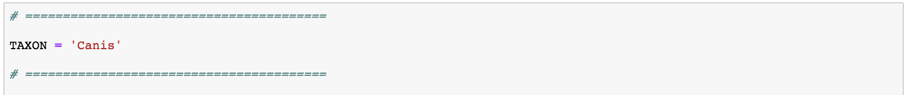
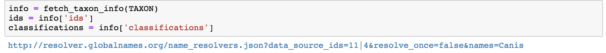
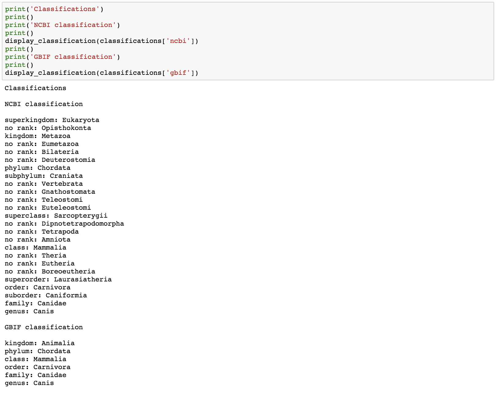
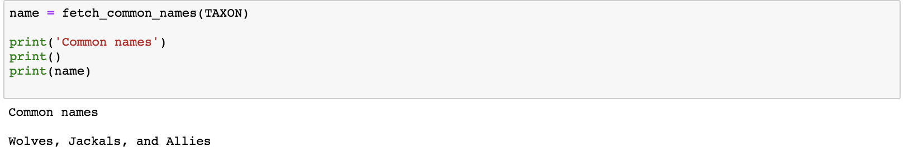
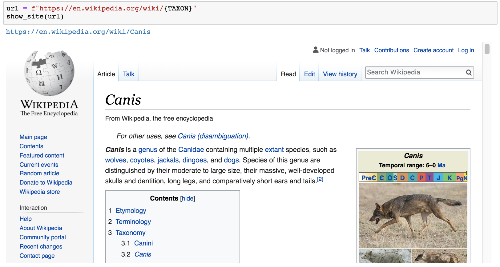
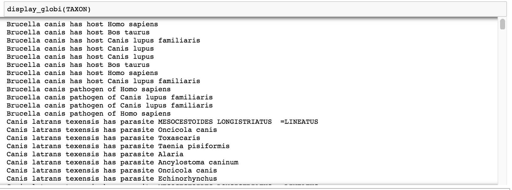

# Taxa Lookup

Jupyter notebook to lookup info about a taxon.

Done for "Speeding Up Science" workshop.

Demo: 

## Features

Enter in a taxon in the first line.

Connect to [Global Names](http://resolver.globalnames.org/) to grab info about the taxon.

Get the the [NCBI](https://www.ncbi.nlm.nih.gov/taxonomy) and [GBIF](https://www.gbif.org) classifications.

Get common names for the taxon from [iNaturalist](https://www.inaturalist.org/).

Display associated pages from various sites such as [Wikipedia](https://www.wikipedia.org/), [GBIF](https://www.gbif.org), [NCBI](https://www.ncbi.nlm.nih.gov/taxonomy), and [Lifemap](http://lifemap-ncbi.univ-lyon1.fr/).

Display biotic interactions for the taxon via [Global Biotic Interactions](https://www.globalbioticinteractions.org/).

